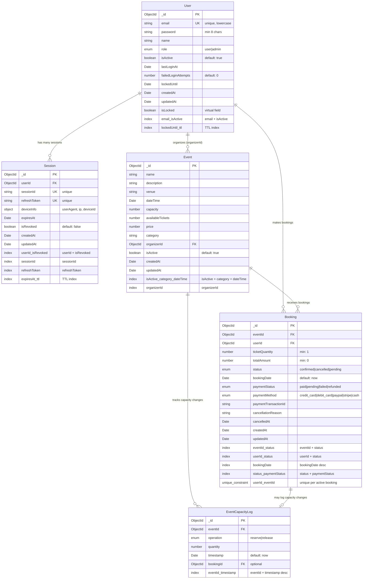

# Event Booking System - Entity Relationship Diagram

## Key Relationships & Business Rules

### **User Management**
- **Users** can have multiple **Sessions** for device management
- **Users** can organize multiple **Events** (via `organizerId`)
- **Users** can make multiple **Bookings**
- Account locking mechanism with `failedLoginAttempts` and `lockedUntil`

### **Event Management**
- **Events** are created by **Users** (organizers)
- **Events** track available tickets through `availableTickets` field
- **Events** can have multiple **Bookings**
- **EventCapacityLog** maintains audit trail of ticket reservations/releases

### **Booking System**
- **Bookings** link **Users** to **Events**
- Unique constraint: One active booking per user per event
- Payment tracking with status and transaction ID
- Cancellation support with reason and timestamp

### **Capacity Management**
- **EventCapacityLog** tracks all capacity changes
- Links to **Bookings** when capacity changes are booking-related
- Supports both "reserve" and "release" operations

## Database Indexes

### **Performance Optimizations**
- **User**: Email + Active status for authentication
- **Session**: User-based lookups and cleanup
- **Event**: Active events by category and date
- **Booking**: Event and user-based queries, payment status filtering
- **EventCapacityLog**: Event-based capacity tracking

### **TTL (Time To Live) Indexes**
- **User**: Auto-cleanup of expired locks
- **Session**: Auto-cleanup of expired sessions
- **EventCapacityLog**: Automatic cleanup based on timestamp

## Security Features

### **Authentication & Authorization**
- Secure session management with refresh tokens
- Device tracking for security monitoring
- Account locking after failed attempts
- Role-based access control (user/admin)

### **Data Protection**
- Password fields excluded from JSON serialization
- Sensitive fields hidden in API responses
- Audit trail for capacity changes