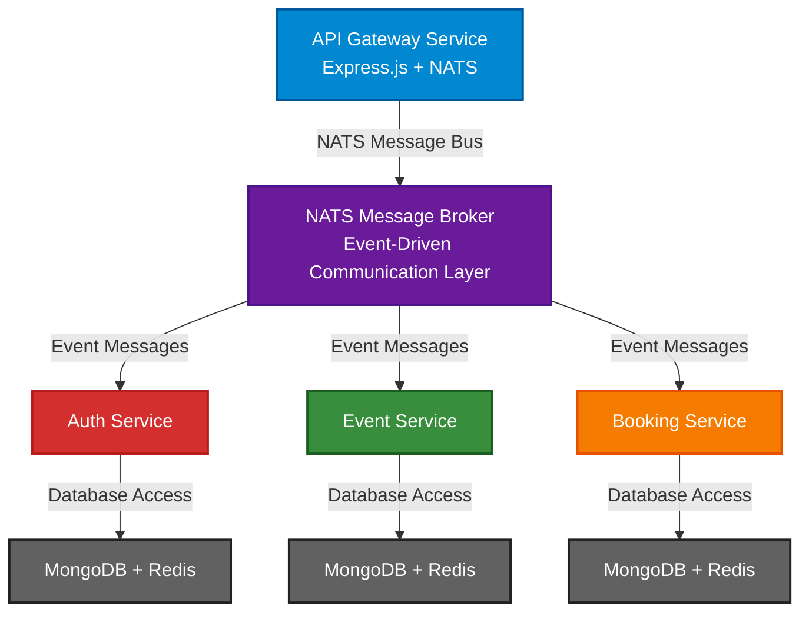

# Evently Microservices Architecture

## Overview

Evently is a **scalable, event-driven microservices platform** for event management and ticketing. The architecture leverages **NATS** as a message broker for decoupled communication between services, with **MongoDB** for persistence and **Redis** for caching and distributed locking.

---

## Architecture

