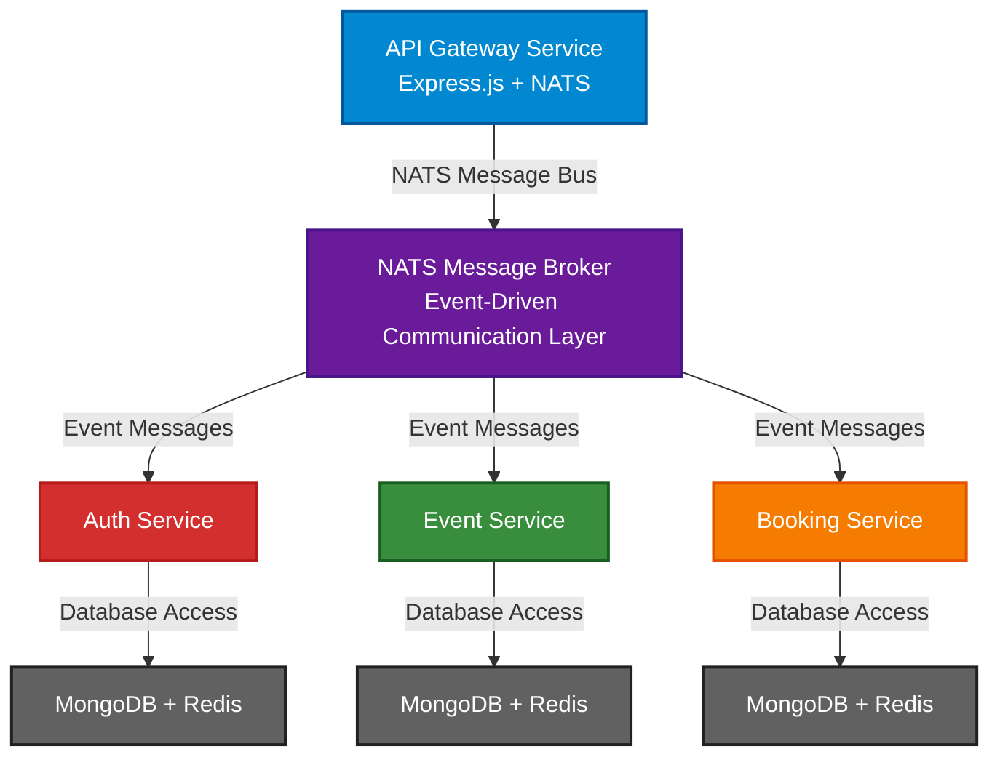
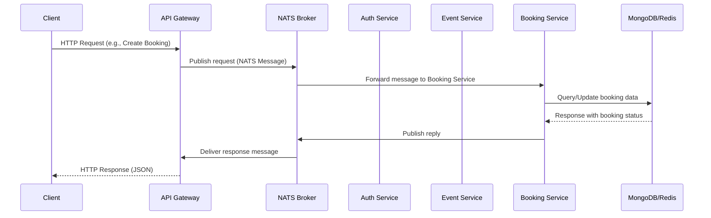
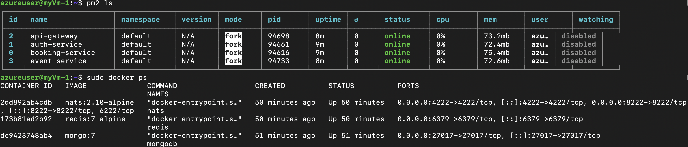
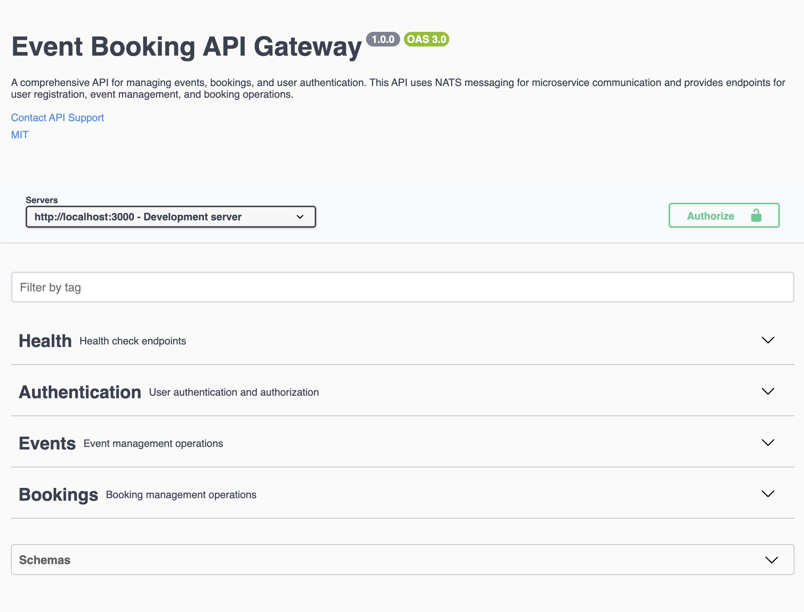

# Evently Microservices Architecture

## Overview

Evently is a **scalable, event-driven microservices platform** for event management and ticketing. The architecture leverages **NATS** as a message broker for decoupled communication between services, with **MongoDB** for persistence and **Redis** for caching and distributed locking.

---

## Architecture




## Request Flow



# Key Components

## 1. **API Gateway**
* Exposes REST APIs (`/auth`, `/events`, `/bookings`).
* Validates requests (Zod).
* Converts HTTP → NATS messages (request/reply).
* Handles timeouts & response forwarding.

## 2. **Auth Service**
* User registration, login, refresh, logout.
* JWT token management.
* Circuit breaker ensures DB failures don't cascade.

## 3. **Event Service**
* Event CRUD (create, update, delete, deactivate).
* Search events, list upcoming events.
* Redis caching for frequently accessed data.
* Cleanup of expired events.

## 4. **Booking Service**
* Ticket reservations, cancellations.
* Capacity enforcement with Redis locks.
* Expired booking cleanup jobs.
* Idempotent booking operations.

## 5. **NATS Message Broker**
* Pub/Sub for domain events (e.g., `EventCreated`, `BookingConfirmed`).
* Request/Reply for synchronous API calls.
* Queue groups for load balancing across replicas.

## Resilience & Reliability

* **Circuit Breaker** - Each service wraps DB/Redis calls with a circuit breaker.
   * Avoids hammering unavailable dependencies.
   * Allows quick failover + recovery.

* **Redis Distributed Locks**
   * Prevents race conditions (e.g., two users booking the last ticket simultaneously).
   * Ensures atomic operations on capacity-sensitive workflows.

* **Caching**
   * Event & booking data cached in Redis.
   * TTL ensures cache freshness (30 mins default).

* **Graceful Shutdowns**
   * Services unsubscribe from NATS before exit.
   * Prevents dangling consumers and message loss.
 

## Deployment on Azure VM

Initially, I attempted to run all services inside Docker containers (MongoDB, Redis, NATS, and each microservice).  
However, I ran into issues when trying to run **all Node.js microservices inside containers** alongside infrastructure services.  
As a workaround, I chose a **hybrid approach**:

- Infrastructure services (`MongoDB`, `Redis`, `NATS`) → run as Docker containers  
- Application microservices (`api-gateway`, `auth-service`, `booking-service`, `event-service`) → run via [PM2](https://pm2.keymetrics.io/), a Node.js process manager

---

### Why PM2?
PM2 is a **production process manager** for Node.js. It spawns and supervises processes using the **Node.js `child_process.fork()` API**, which creates lightweight Node.js child processes with independent event loops, memory, and execution contexts.

Unlike running with `npm start` in a terminal:
- Processes don’t terminate when we close our SSH session  
- Crashes are automatically handled with restarts  
- Logs are captured and rotated  
- Services can be configured to auto-start on VM reboot  


## Production Terminal Screenshot

### Below is a real screenshot of the production environment running on the Azure VM:


---


# Running Locally with Docker Compose

## Prerequisites
- [Docker](https://docs.docker.com/get-docker/) installed  
- [Docker Compose](https://docs.docker.com/compose/install/) installed  

---

## Setup Instructions

**Steps:**

1. Clone the repository

```bash
git clone https://github.com/swataswayam-14/vervious.git
cd vervious
```

2. Copy environment variables
   Create a `.env` file in each service with the following:

```
MONGO_URI=mongodb://localhost:27017/evently
REDIS_URL=redis://localhost:6379
NATS_URL=nats://localhost:4222
JWT_SECRET=your_jwt_secret
```

# Microservices Application

## 3. Local Development Setup

Follow these steps to run the application locally:

### 1. API Gateway

```bash
cd api-gateway
npm install
npm run build
npm run start
```

### 2. Auth Service

```bash
cd auth-service
npm install
npm run build
npm run start
```

### 3. Event Service

```bash
cd event-service
npm install
npm run build
npm run start
```

### 4. Booking Service

```bash
cd booking-service
npm install
npm run build
npm run start
```

## Accessing the Application

Once all services are running, you can access:

- **API Documentation**: [http://localhost:3000/docs](http://localhost:3000/docs)
- **API Endpoints**: [http://localhost:3000/api](http://localhost:3000/api)


## Development Workflow

1. Clone the repository
2. Navigate to each service directory
3. Install dependencies with `npm install`
4. Build the service with `npm run build`
5. Start the service with `npm run start`
6. Repeat for all services
   

4. Access the platform

**Production URL: http://135.235.247.214:3000/api**

> **Note:** Swagger UI is only visible when running locally at `http://localhost:3000/docs`. It does not show in production due to CORS restrictions. Run it locally using `docker compose up` to explore all API routes.

Here's how the **Swagger UI** looks when running locally:



**For complete API route details and comprehensive understanding, please navigate to [API_DOCUMENTATION.md](./API_DOCUMENTATION.md) in the root directory.**
