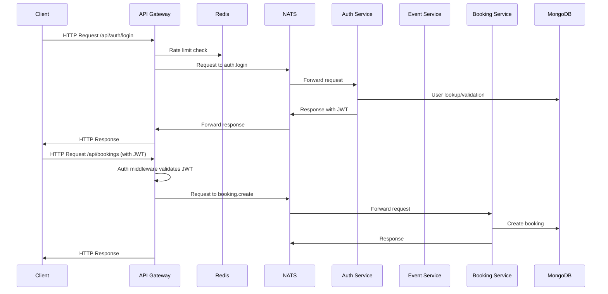
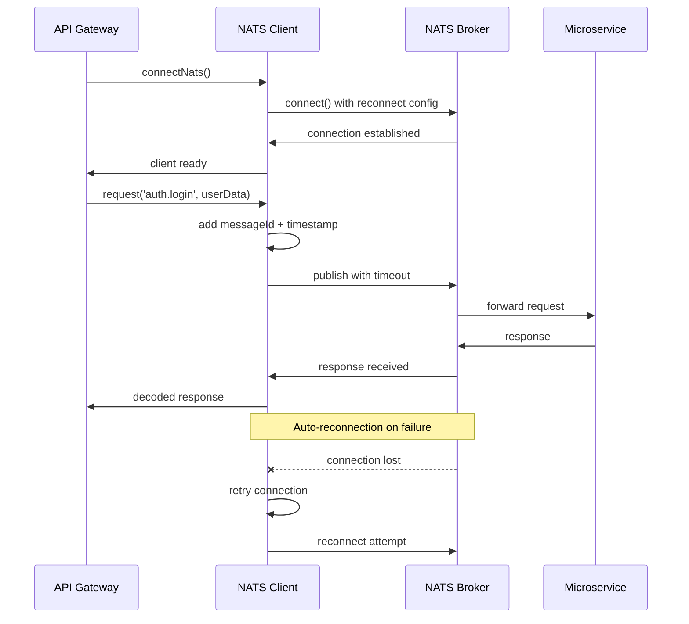
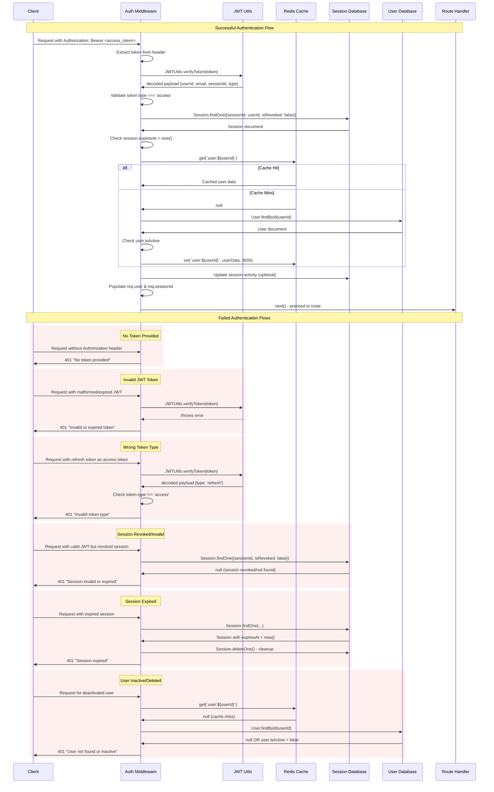
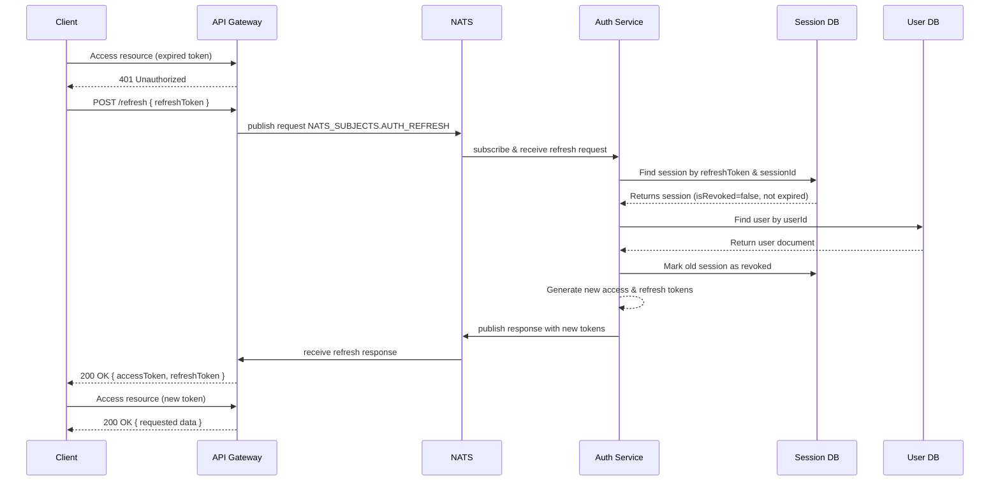
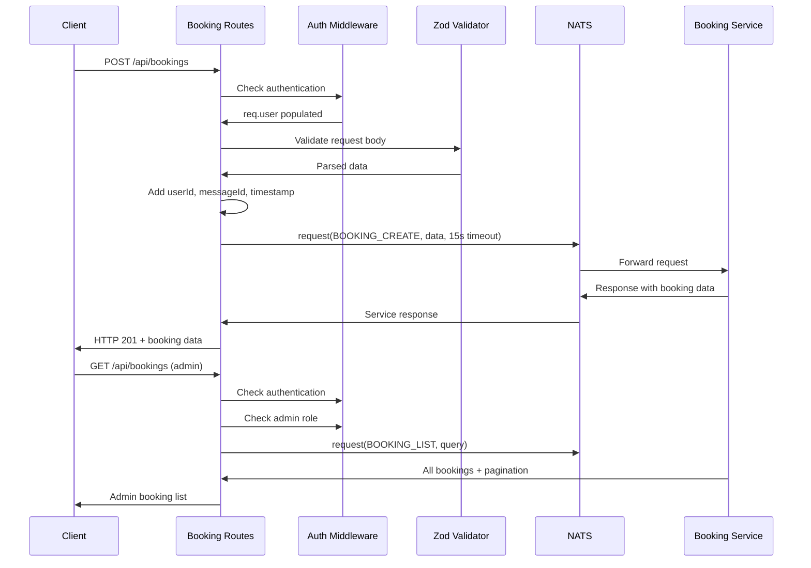
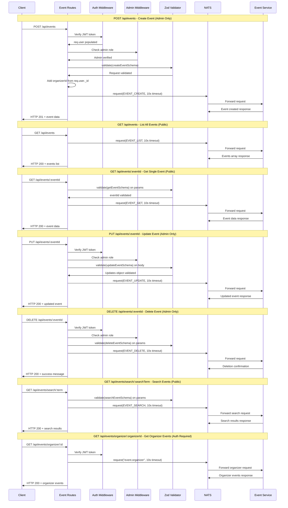
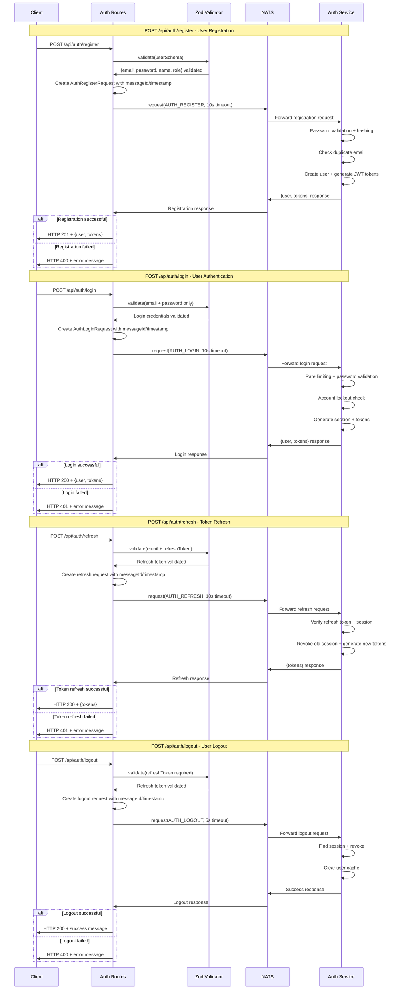
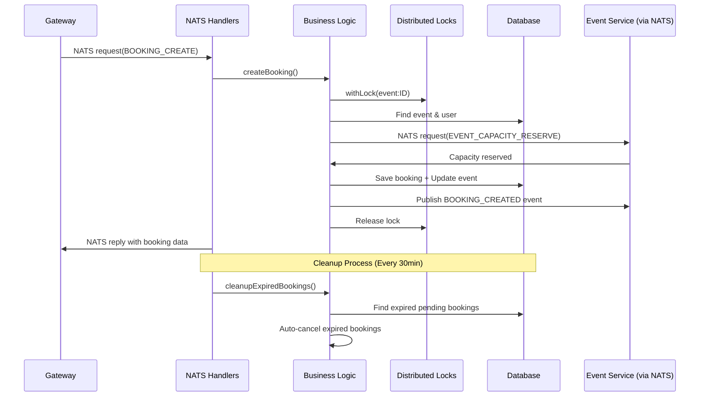
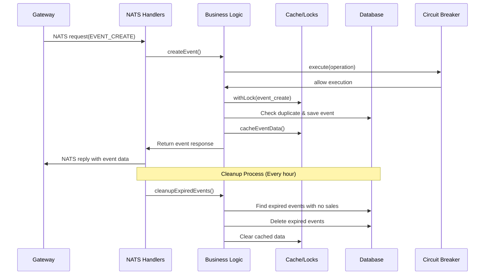
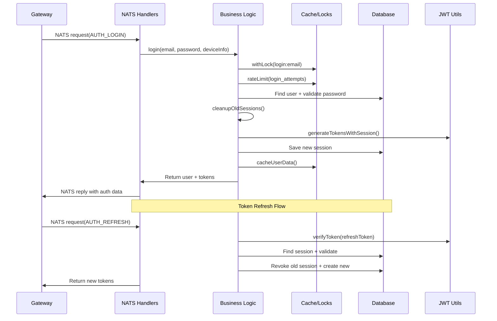

# Overall System Architecture

-------------------------------------------------------------

# Nats Communication Flow

--------------------------------------------------------------------

# Auth Middleware Flow

----------------------------------------------------------------
# Sequence of Refresh Token Validation, Revocation, and New Token Issuance via NATS

-----------------------------------------------------------------

# Booking Routes Flow

------------------------------------------------------------------------
# Event Routes Flow

-----------------------------------------------------------------------
# Auth Routes Flow

-----------------------------------------------------------------------
# Booking Service Flow

-----------------------------------------------------------------------
# Event Service Flow

------------------------------------------------------------------------
# Auth Service Flow

